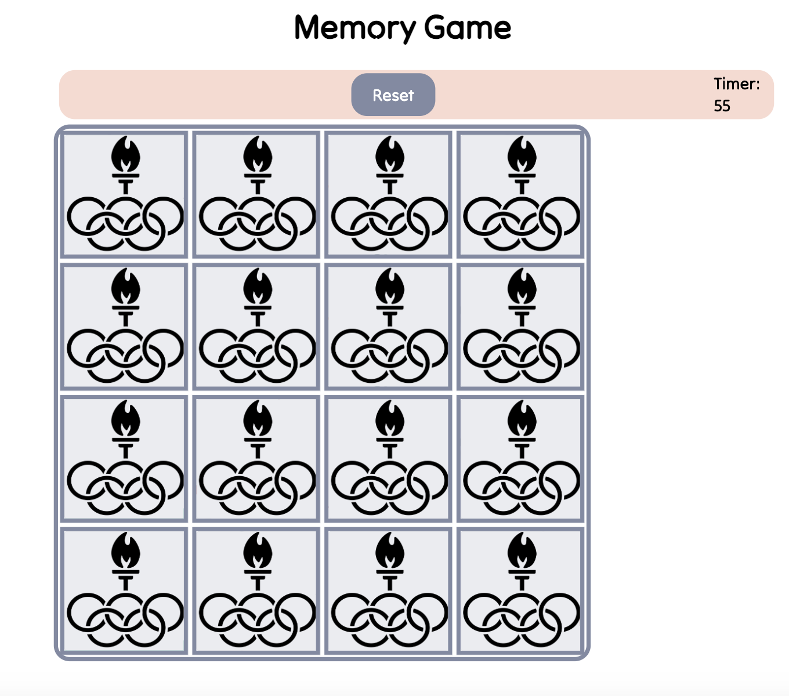

# Memory-Game
The goal of the game is to find matching pairs of cards on the game board. Each turn, flip over two cards. If they match, great! They stay face-up. If not, no worries—just remember where they are for your next turn. You have 3 trials to open the same card, if you missed to match that card, your game is over and you need to try again. 

#### A site built from scratch as my first website project.

## Description
The Memory Game is my first attempt to create a front-end application. The intention of developing this game is is to demonstrate and practice javascript logic and connect it with HTML and style in CSS in a very condensed period. 

## Table of Contents
* [Technologies Used](#technologiesused)
* [Features](#features)
* [Design](#design)
* [Project Next Steps](#nextsteps)
* [Deployed App](#deployment)
* [About the Author](#author)

## Technologies Used
* JavaScript
* HTML
* CSS

## Features
* Users can read instructions and start the game
* Users can flip two cards at the same time
* Users can see the timer and have only 60 seconds to win the game
* Users can match 2 the same cards and see it on the screen 
* Users can see a pop-up window if the won the game or lost the game and play again 
* Users can match all 16 cards
  
## Whiteboard Images
*Original Whiteboard sketch
*[Miro](https://miro.com/app/board/uXjVNdX8i8M=/)

## Trello Planning
* All planning in notebooks
* [Trello](https://trello.com/b/MkTwlDZ3/project-1)

## Design
* Design elements implemented using HTML5 and CSS3. 

## Project Next Steps
* Users can choose multiple players
* Users can have multiple level of difficulty
* UI will be enhenced

## Deployed Link
[Netlify](https://thejoospod.netlify.app)

* You can view the repository:
[Github.com](https://github.com/Gr8ness21/joosPodcast)
* If unable to view please go live locally through VS Code
    
## Works Cited:
* N/A

## About The Author
I am an inspired entrepreneur and am learning code to find my company one day. Here is my first attempt to build a game to practice front-end development. I look for creative solutions to real-world problems and think of technical ways to address them. While no application is ever perfect, I find joy in the process and all my final products!
